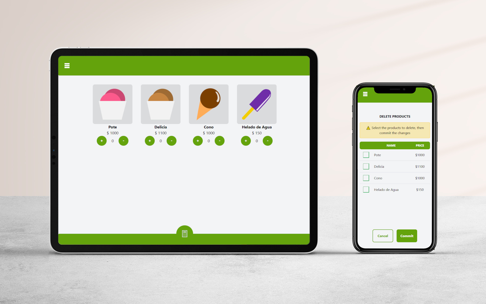

# 📋 Web para calcular productos



---

## 📁 Estructura del Proyecto

```
react-product-calculator/
├── 📁 src/
│   ├── 📁 adapters/             # Adaptadores de información
│   ├── 📁 components/           # Componentes de React
│   ├── 📁 config/               # Ajustes y constantes
│   ├── 📁 contexts/             # Contextos de React
│   ├── 📁 hooks/                # Customs Hooks de React
│   ├── 📁 logic/                # Lógica de negocio
│   ├── 📁 pages/                # Componentes de páginas (sin react-router aún)
│   ├── 📁 services/             # Servicios de datos
│   ├── app.jsx 
│   └── main.jsx 
└── README.md
```

---

## 🚀 Instalación

### Requisitos previos
- Node.js 18+ 
- npm or yarn

### 1. Clonar este repositorio
```bash
git clone https://github.com/AlexRubenPumari/react-product-calculator.git
cd react-product-calculator
```

### 2. Instalar dependencias
```bash
npm install
```

---

## 🚀 Ejecutando el proyecto

### Inicializar el Servidor de Desarrollo
```bash
npm run dev
```
El servidor se aloja por defecto en: `http://localhost:5137`

### Inicializar el Servidor de Desarrollo con Host Binding
```bash
npm run host
```
El servidor se aloja por defecto en: `http://localhost:5500`
